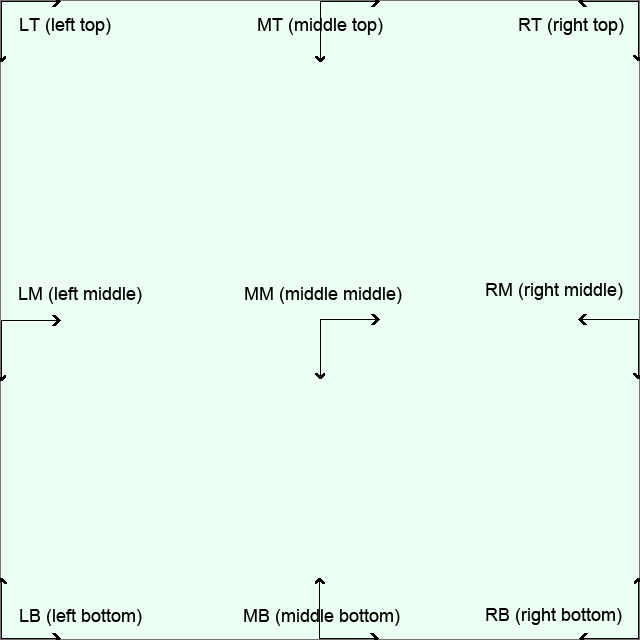

# ImageWorkshop

## Corners / positions schema of an image

All positions on an image, used for some methods. Arrows represent the translation if you give a `$positionX` (horizontal) or a `$positionY` (vertical).

[<< List of methods](list-of-methods.md)
