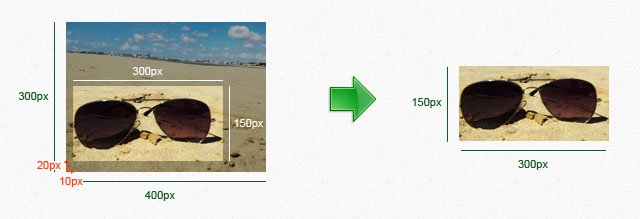
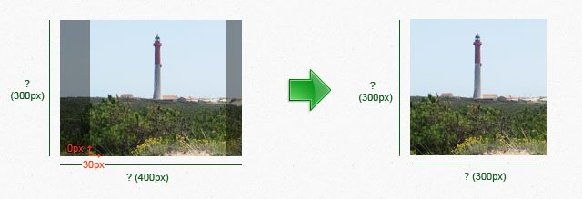

# ImageWorkshop

## Cropping

You can crop a layer and place the crop on the layer background where you want thanks to the argument `$position`: see the [Corners / positions schema of an image](corners-schema-image.md).
Read the tutorial [Creating thumbnails](../tutorials/creating-thumbnails.md) to see examples.

### 1. Cropping

In pixel:

```php
$newWidth = 120; // px
$newHeight = 100; // px
$positionX = 30; // left translation of 30px
$positionY = 20; // top translation of 20px
$position = "LT";

$layer->cropInPixel($newWidth, $newHeight, $positionX, $positionY, $position);
```

In percent:

```php
$newWidth = 80; // %
$newHeight = 70; // %
$positionX = 5; // right translation of 5%
$positionY = 3; // bottom translation of 3%
$position = "RB";

$layer->cropInPercent($newWidth, $newHeight, $positionX, $positionY, $position);
```

Lets see it in action !
I choose to place a selector (for the crop) of 300px/150px placed at the left bottom corner of the layer background (`$position = 'LB';` for 'Left Bottom'). I also choose to move the selector of 10px from the left (`$positionX = 10;`) and 20px from the bottom (`$positionY = 20;`):

```php
$layer->cropInPixel(300, 150, 10, 20, 'LB');
```

And the result:



### 2. Cropping the maximum possible of a layer

It will result a square having the dimension of the smallest side of the layer.

In pixel:

```php
$positionX = 0; // px, without left translation
$positionY = 0; // px, without top translation

$layer->cropMaximumInPixel($positionX, $positionY, "LT");
```

In percent:

```php
$positionX = 0; // %, without left translation
$positionY = 0; // %, without top translation

$layer->cropMaximumInPercent($positionX, $positionY, "LT");
```

An example to understand !
I decide to crop the maximum possible of the layer. I choose to place the selection in the middle of the layer (`$position = 'MM';` for 'Middle Middle') with a shift of 30px from the left (`$positionX = 30;`) and no one from the bottom (`$positionY = 0;`, try to change it to test !):

```php
$layer->cropMaximumInPercent(30, 0, 'MM');
```

And the result:

(Consider that we don't know dimensions of the layer sides, but I wrote them to understand).



[<< Saving](saving.md) - [Filter >>](filter.md)
