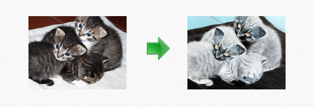

# ImageWorkshop

## Filter

You can apply a [filter](http://php.net/manual/en/function.imagefilter.php) on a layer and its sublayers.

```php
$filterType = IMG_FILTER_SELECTIVE_BLUR;
$arg1 = $arg2 = $arg3 = $arg4 = null;
$recursive = false; // apply the filter on sublayers

$layer->applyFilter($filterType, $arg1, $arg2, $arg3, $arg4, $recursive);
```

Warning: rather than using the recursive attribute, merge your layers if possible before applying a filter because it could be a possible source of display bugs.

Lets see it in action, we will apply a simple negative filter on the layer:

```php
$layer->applyFilter(IMG_FILTER_NEGATE); // With this filter, we can ignore other params...
```

Our filter in image:



[<< Cropping](cropping.md) - [Flip >>](flip.md)
