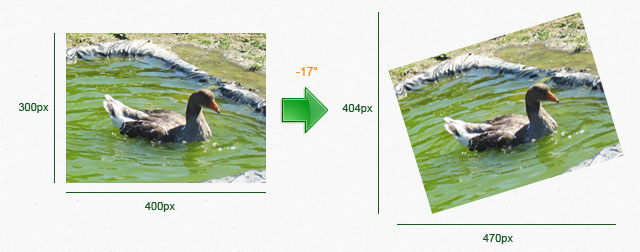

# ImageWorkshop

## Rotating

Rotating a layer and its sublayers:

```php
$degrees = -17;

$layer->rotate($degrees);
```

What we get:



Be carefull, as you see, a rotation can enlarge your layer !

[<< Resizing](resizing.md) - [Writing >>](writing.md)
