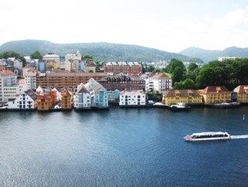

# ImageWorkshop

## Introduction

PHP Image Workshop is an **open source** class using **GD library** that helps you to manage images with PHP.

This class is thought like photo editing software (Photoshop, GIMP...): you can superimpose many layers or even layer groups, each layer having a background image.

It makes the class the most **flexible** ever !

## For what ?

It is thought to do simple tasks like creating **thumbnails** or pasting **watermarks** and also to do more complex tasks (multiple superimpositions, image positioning...).

Here is a none exhaustive list of what you can do with: pasting an image (or multiple) on another one, cropping, moving, resizing, rotating, superposing, writing...

## How it works ?

An ImageWorkshopLayer object could be 2 different things depending on how you want to use it:

* **a layer**: this is a rectangle which has a transparent background image by default and where you can paste images (from your hard drive or an upload form...) on its background.
* **a group layer**: a layer that includes multiple sublayers at different level in its stack, all leveled on the top of its background. If you perform an action on the group, all its sublayers (and subgroups) will be affected !

Understand that an **ImageWorkshop object** is a **layer AND a group** at the same time, unlike Photoshop (a group doesn't have a background): it has got a **background image** (transparent by default) and a **stack of sublayers** (empty by default) on the top of its background.

When you have finished manipulating your layers, you just have to execute a method to get the merged image of all layer backgrounds !

## Give me an example !

Right, we will add a watermark on my picture taken on my trip to Norway:

The picture:



The watermark:


### Initialization of the layers:

```php
// We initialize the norway layer from the picture norway.jpg
$norwayLayer = ImageWorkshop::initFromPath('/path/to/images/norway.jpg');

// We initialize the watermark layer from the picture watermark.png
$watermarkLayer = ImageWorkshop::initFromPath('/path/to/images/watermark.png');
```

These layers are created from pictures: they have now the images as a background and their width and height !

### Surperimposition of the watermark:

```php
// Previous code ...

// We add the watermark in the sublayer stack of $norwayLayer
$norwayLayer->addLayerOnTop($watermarkLayer, 12, 12, "LB");
```

`$norwayLayer` is used like a **group**: you can superimpose multiple layers on its stack, each layer is leveled on the top of its background image. Here, we just add `$watermarkLayer` on its stack.

We chose the `$watermarkLayer` position thanks to the 4rth parameter "**LB**" ("**Left Bottom**") and we applied translations of 12px from the left and the bottom of $norwayLayer borders.

### Manage the result:

```php
// previous code...

$image = $norwayLayer->getResult(); // This is the generated image !

header('Content-type: image/jpeg');
imagejpeg($image, null, 95); // We choose to show a JPG with a quality of 95%
exit;
```

Here we choose to [show](documentation/showing.md) the final image in the navigator, but you can call different methods to generate the image, like [save()](documentation/saving.md) method to save the image in a folder.

And the result:


So easy, isn't it ?

## Learn more

Learn how to use ImageWorkshop in 5 minutes thanks to the [quickstart tutorial](quickstart.md) or read all about the class in the [documentation](index.md) part.
