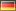
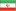

# ImageWorkshop

## Examples & tutorials

Learn ImageWorkshop thanks to tutorials ! You will see different cases how to use the class and discover many options.

* [Adding a watermark](tutorials/adding-a-watermark.md): We will see how to add a watermark on a picture, and see different interesting options that you can use !
* [Beautify your images with filters](tutorials/beautify-your-images-with-filters.md): We will play with GD filters to beautify our images.
* [Creating thumbnails](tutorials/creating-thumbnails.md): We will see many ways to create a thumbnail from a picture thanks to resizing, cropping methods...
* [Manage animated GIF](tutorials/manage-animated-gif.md): Learn how to manage your animated GIF images with the class.
* [Playing with layers: create a christmas card](tutorials/playing-with-layers.md): We will see how to play with many layers and layer groups in a main document.

### External links:

#### Deutsch 

* A quickstart tutorial: [Serverseitige Bildbearbeitung leicht gemacht](http://t3n.de/news/phpimageworkshop-serverseitige-417213/).

#### English 

* Using composer: [Package Watch: Image Management](http://philsturgeon.co.uk/blog/2012/09/package-watch-image-management).

#### Español 

* Tutorial "Adding a watermark": [Crear marcas de agua con PHP](http://tednologia.com/marcas-de-agua-php/).

#### Français 

* ~~Full documentation: [Gérer facilement ses images en PHP avec ImageWorkshop](http://www.siteduzero.com/tutoriel-3-686283-1-gerer-facilement-ses-images-en-php-avec-imageworkshop.html).~~
* ~~Introduction: [ImageWorkShop - calques d'images avec PHP](http://blog.alexis-ragot.com/imageworkshop-php-images-gd).~~
* Introduction: [ImageWorkshop, une classe PHP flexible de gestion d’images](http://www.megaptery.com/2012/05/image-workshop-classe-php-flexible-gestion-images.html).

#### فارسی 

* ~~Introduction: [PHP ویرایش تصاویر در](http://codenevesht.com/manipulating-images-using-the-php-imageworkshop-class/).~~
