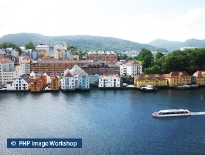
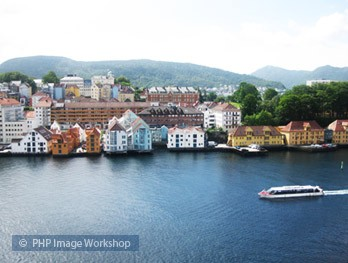
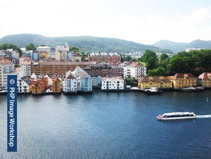
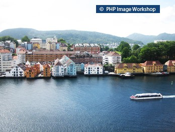
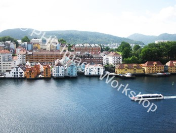

# ImageWorkshop

## Adding a watermark

### The purpose of the tutorial

We will see how to add a watermark on a picture, and see different interesting options that you can use !

### Images that we will use

The picture:


The watermark:


### 1. Adding a text watermark

```php
$norwayLayer = ImageWorkshop::initFromPath('/path/to/images/norway.jpg');

// This is the text layer
$textLayer = ImageWorkshop::initTextLayer('© PHP Image Workshop', '/path/to/fonts/arial.ttf', 11, 'ffffff', 0);

// We add the text layer 12px from the Left and 12px from the Bottom ("LB") of the norway layer:
$norwayLayer->addLayerOnTop($textLayer, 12, 12, "LB");

$image = $norwayLayer->getResult();
header('Content-type: image/jpeg');
imagejpeg($image, null, 95); // We chose to show a JPG with a quality of 95%
exit;
```

You can see the result:


### 2. Adding an image watermark)

```php
$norwayLayer = ImageWorkshop::initFromPath('/path/to/images/norway.jpg');

$watermarkLayer = ImageWorkshop::initFromPath('/path/to/images/watermark.png');

$norwayLayer->addLayer(1, $watermarkLayer, 12, 12, "LB");

$image = $norwayLayer->getResult();
```



### 3. Adding some opacity to the watermark

```php
// By reusing the previous snippet, you can set opacity to the watermark layer
// before to add it on the $norwayLayer

$watermarkLayer->opacity(40);
```



### 4. Adding a vertical watermark

```php
$norwayLayer = ImageWorkshop::initFromPath('/path/to/images/norway.jpg');

$watermarkLayer = ImageWorkshop::initFromPath('/path/to/images/watermark.png');

// We proceed to the $watermarkLayer rotation
$watermarkLayer->rotate(90);

$norwayLayer->addLayer(1, $watermarkLayer, 12, 12, "LB");

$image = $norwayLayer->getResult();
```



### 5. Position your watermark

Don't forget that you can choose the position of your watermark thanks to the fifth parameter of addLayer() method !

See the [Corners / positions schema of an image](../documentation/corners-schema-image.md) to choose the position you want.

```php
// "RT": Right Top position, translation of 30px from right and 10px from top
$norwayLayer->addLayer(1, $watermarkLayer, 30, 10, "RT");
```



### 6. Large transparent text

```php
// We want to add a text on the diagonal of the norway picture,
// We create a function to calculate the angle with pythagore & thales theorems
// this is not an obligation, you can choose another rotation angle...
function calculAngleBtwHypoAndLeftSide($bottomSideWidth, $leftSideWidth)
{
    $hypothenuse = sqrt(pow($bottomSideWidth, 2) + pow($leftSideWidth, 2));
    $bottomRightAngle = acos($bottomSideWidth / $hypothenuse) + 180 / pi();

    return -round(90 - $bottomRightAngle);
}

// Init' layers
$norwayLayer = ImageWorkshop::initFromPath('/path/to/images/norway.jpg');
$textLayer = ImageWorkshop::initTextLayer('© PHP Image Workshop', '/path/to/fonts/arial.ttf', 22, 'ffffff', calculAngleBtwHypoAndLeftSide($norwayLayer->getWidth(), $norwayLayer->getHeight()));

// Some funky opacity
$textLayer->opacity(60);

// We add the $textLayer on the norway layer, in its middle
$norwayLayer->addLayer(1, $textLayer, 0, 0, 'MM');

$image = $norwayLayer->getResult();
````


