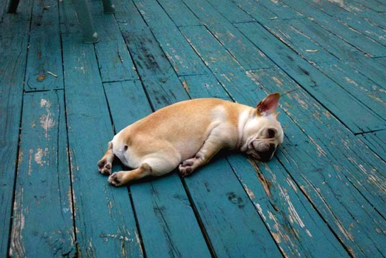

# ImageWorkshop

## Beautify your images with filters

### The purpose of the tutorial

A short tutorial to play with [GD filters](http://php.net/manual/en/function.imagefilter.php) to beautify our images by adding some constrast and brightness.

### Image that we will use


Initialize your layer and do the following steps:

### 1. Add some constrast

```php
$dogLayer->applyFilter(IMG_FILTER_CONTRAST, -15, null, null, null, true);
```

### 2. Add some brightness

```php
// previous code ...

$dogLayer->applyFilter(IMG_FILTER_BRIGHTNESS, 8, null, null, null, true);
```

### 3. All the code of this tutorial

```php
$dogLayer = ImageWorkshop::initFromPath(__DIR__.'/path/to/images/larve-dog.jpg');

$dogLayer->applyFilter(IMG_FILTER_CONTRAST, -15, null, null, null, true); // constrast
$dogLayer->applyFilter(IMG_FILTER_BRIGHTNESS, 8, null, null, null, true); // brightness

// Saving / showing...
$dogLayer->save(__DIR__.'/folder/', 'doggy.jpg', true, null, 95)
```

### 4. The result: before and after filters



