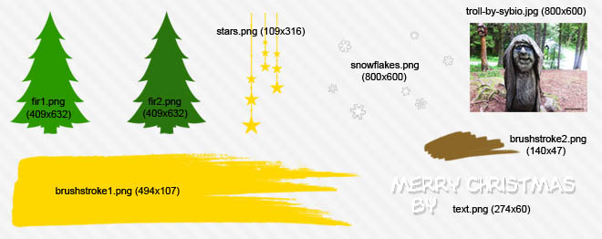
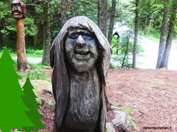
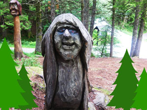
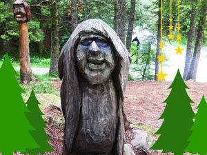
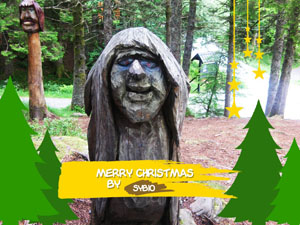
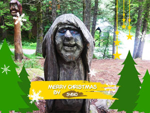
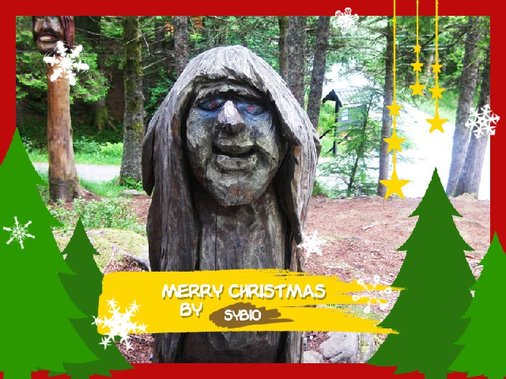

# ImageWorkshop

## Playing with layers: create a christmas card

The purpose of the tutorial

Imagine that you've got a service which allowed users to create their own christmas card. They can choose plural decoration images on your website, composed their card and can add their own photo of their family or themselves. All works thanks to a javascript system and you have to generate the image card by AJAX request.


We will not do this system, we just see how to make the card with some images !
We will especially have fun with layers and layer groups, hahahaha...

### Images that we will use



You can download a .zip containing this images [here](files/merry-christmas-card-tutorial.zip) to follow the tutorial !

### Context

The visitor composed his card by adding some decoration. He added his picture (here, a troll face), give his name (here Sybio) and clicked on a button to generate it. An AJAX request was sent to our script, containing the name of the images, the text font, their coordonnates and also their width and height...

Lets create this script !

### 1. Creation of our document layer and the action to show the finale image

```php
// #1: We create our document, which have the troll picture on its background

$document = ImageWorkshop::initFromPath(__DIR__.'/path/to/images/troll-by-sybio.jpg');

// ALL THE FOLLOWING CODE WILL BE PLACE HERE

// Showing the christmas card
$image = $document->getResult("ffffff");

header('Content-type: image/jpeg');

imagejpeg($image, null, 95); // We choose to show a JPEG with a quality of 95%
```

We create the layer which will contain all the other layers. We specified a background image (the layer will have the width and height of the image). For the moment, we just see the troll face !

### 2. We create the left group of fir

```php
// #2: We open the trees as layers, and create the left group containing 2 firs
$firLayer1 = ImageWorkshop::initFromPath(__DIR__.'/path/to/images/fir1.png');

$firLayer2 = ImageWorkshop::initFromPath(__DIR__.'/path/to/images/fir2.png');

// Here, we clone both fir layers to use them for a second group (step 3)
$firLayer3 = clone $firLayer1;
$firLayer4 = clone $firLayer2;

// We resize the second tree which must be smaller than the first
$firLayer2->resizeInPercent(65, 65);

// We initialize group which will contains 2 firs
$firGroup1 = ImageWorkshop::initVirginLayer($firLayer1->getWidth() + $firLayer2->getWidth(), $firLayer1->getHeight());

// We add the 2 trees at different position in the group
$firGroup1->addLayer(1, $firLayer1);
$firGroup1->addLayer(1, $firLayer2, round($firLayer1->getWidth() * 0.55), 0, 'LB');

// We want a height of 409px for the group
$firGroup1->resizeInPixel(null, 409, true);

// We add the group at the left bottom of our card
$document->addLayer(1, $firGroup1, -105, -10, 'LB');
```

We create the first group of trees and place it at the left of our main layer, here the result:



I encourage you to replace `$image = $document->getResult();` by `$image = $firGroup1->getResult();` to see our group of firs separately !

### 3. We create the right group of fir

```php
// #3: We create the right group containing 2 firs too

$firLayer3->resizeInPixel(244, null, true);
$firLayer4->resizeInPixel(345, null, true);

// Then we create a second group of fir
$firGroup2 = ImageWorkshop::initVirginLayer($firLayer3->getWidth() + $firLayer4->getWidth(), $firLayer4->getHeight());

// we add the firs in the second group
$firGroup2->addLayer(1, $firLayer4);
$firGroup2->addLayer(2, $firLayer3, round($firLayer4->getWidth() * 0.57), 0, 'LB');

// we resize the second fir group
$firGroup2->resizeInPixel(null, 345, true);

// We add the second group at the right bottom position of our card
$document->addLayer(2, $firGroup2, -160, -10, 'RB');
````

We create the second group of trees and place it at the right bottom position of our main document, the manipulation is the same !



### 4. We add the stars on the document

```php
// #4: We create and add the stars layer on the document
// We want the star at the top of the document, and roughly at the 3/4 of the document

$starLayer = ImageWorkshop::initFromPath(__DIR__.'/path/to/images/stars.png');

$document->addLayer(3, $starLayer, round($document->getWidth() * 0.75), 0);
````

Stars are added !



### 5. We add a group containing the message and the brushstrokes in the main layer

```php
// #5: We create a group that contain the message of our card, to play, $brushstroke1Layer will be our group
$brushstroke1Layer = ImageWorkshop::initFromPath(__DIR__.'/path/to/images/brushstroke1.png');

$brushstroke2Layer = ImageWorkshop::initFromPath(__DIR__.'/path/to/images/brushstroke2.png');

$sentenceLayer = ImageWorkshop::initFromPath(__DIR__.'/path/to/images/text.png');

// The card creator name layer (this is a text layer)
$textLayer = ImageWorkshop::initTextLayer('Sybio', '/path/to/fonts/garfield.ttf', 14, 'ffffff', 0);

// Adding the name of the card creator
$brushstroke2Layer->addLayer(1, $textLayer, 25, 13);

// Adding the $brushstroke2Layer on $brushstroke1Layer
$brushstroke1Layer->addLayer(1, $brushstroke2Layer, 0, 53, 'MT');

// Adding the message image on the top of $brushstroke1Layer
$brushstroke1Layer->addLayer(2, $sentenceLayer, -10, 20, 'MT');

// We add the group $brushstroke1Layer on the document
$document->addLayer(4, $brushstroke1Layer, 0, 425, 'MT');
```

We've got a beautiful message, doesn't it ?



### 6. Lets add the snowflakes on the top of the document

```php
// #6: We create and add the flakes layer on the document

$flakesLayer = ImageWorkshop::initFromPath(__DIR__.'/path/to/images/snowflakes.png');

$document->addLayer(5, $flakesLayer);
```



### 7. We add the border layer

```php
// #7: God, we forgot the red border... which must be behind all the decoration (at level 1) !
// Don't worry, ImageWorkshop is flexible
// We will create the border image and then insert it in the document before all the decoration layer levels
// So we will insert it at the first level (level 1)
// We want a border of 25px

// We initialize a layer which have a transparent background image
$borderLayer = ImageWorkshop::initVirginLayer($document->getWidth(), $document->getHeight()); // This layer will have the width and height of the document

$borderWide = 25;
$borderColor = "be0a0b";

$horizontalBorderLayer = ImageWorkshop::initVirginLayer($document->getWidth(), $borderWide, $borderColor);

$verticalBorderLayer = ImageWorkshop::initVirginLayer($borderWide, $document->getHeight(), $borderColor);

// Then we add 2 horizontal borders, on the top and the bottom of the borderLayer
// and 2 vertical borders on the left and right of the borderLayer
$borderLayer->addLayer(1, $horizontalBorderLayer, 0, 0);
$borderLayer->addLayer(2, $horizontalBorderLayer, 0, 0, 'LB');
$borderLayer->addLayer(3, $verticalBorderLayer, 0, 0);
$borderLayer->addLayer(4, $verticalBorderLayer, 0, 0, 'RT');

// Finally, we add the borderLayer on our document
// But we will place it at the first level of the document !!!!
// By doing this, all our layers contained in the document will be
// shifted by one level

$document->addLayer(1, $borderLayer);
```

### 8. We (can) resize the document

```php
// #8: Resizing the document

$document->resizeInPixel(640, null, true);
```

### All the code

```php
// #1: We create our document, which have the troll picture on its background

$document = ImageWorkshop::initFromPath(__DIR__.'/path/to/images/troll-by-sybio.jpg');

// #2: We open the trees as layers, and create the left group containing 2 firs
$firLayer1 = ImageWorkshop::initFromPath(__DIR__.'/path/to/images/fir1.png');

$firLayer2 = ImageWorkshop::initFromPath(__DIR__.'/path/to/images/fir2.png');

// Here, we clone both fir layers to use them for a second group (step 3)
$firLayer3 = clone $firLayer1;
$firLayer4 = clone $firLayer2;

// We resize the second tree which must be smaller than the first
$firLayer2->resizeInPercent(65, 65);

// We initialize group which will contains 2 firs
$firGroup1 = ImageWorkshop::initVirginLayer($firLayer1->getWidth() + $firLayer2->getWidth(), $firLayer1->getHeight());

// We add the 2 trees at different position in the group
$firGroup1->addLayer(1, $firLayer1);
$firGroup1->addLayer(1, $firLayer2, round($firLayer1->getWidth() * 0.55), 0, 'LB');

// We want a height of 409px for the group
$firGroup1->resizeInPixel(null, 409, true);

// We add the group at the left bottom of our card
$document->addLayer(1, $firGroup1, -105, -10, 'LB');

// #3: We create the right group containing 2 firs too

$firLayer3->resizeInPixel(244, null, true);
$firLayer4->resizeInPixel(345, null, true);

// Then we create a second group of fir
$firGroup2 = ImageWorkshop::initVirginLayer($firLayer3->getWidth() + $firLayer4->getWidth(), $firLayer4->getHeight());

// we add the firs in the second group
$firGroup2->addLayer(1, $firLayer4);
$firGroup2->addLayer(2, $firLayer3, round($firLayer4->getWidth() * 0.57), 0, 'LB');

// we resize the second fir group
$firGroup2->resizeInPixel(null, 345, true);

// We add the second group at the right bottom position of our card
$document->addLayer(2, $firGroup2, -160, -10, 'RB');

// #4: We create and add the stars layer on the document
// We want the star at the top of the document, and roughly at the 3/4 of the document

$starLayer = ImageWorkshop::initFromPath(__DIR__.'/path/to/images/stars.png');

$document->addLayer(3, $starLayer, round($document->getWidth() * 0.75), 0);

// #5: We create a group that contain the message of our card, to play, $brushstroke1Layer will be our group
$brushstroke1Layer = ImageWorkshop::initFromPath(__DIR__.'/path/to/images/brushstroke1.png');

$brushstroke2Layer = ImageWorkshop::initFromPath(__DIR__.'/path/to/images/brushstroke2.png');

$sentenceLayer = ImageWorkshop::initFromPath(__DIR__.'/path/to/images/text.png');

// The card creator name layer (this is a text layer)
$textLayer = ImageWorkshop::initTextLayer('Sybio', '/path/to/fonts/garfield.ttf', 14, 'ffffff', 0);

// Adding the name of the card creator
$brushstroke2Layer->addLayer(1, $textLayer, 25, 13);

// Adding the $brushstroke2Layer on $brushstroke1Layer
$brushstroke1Layer->addLayer(1, $brushstroke2Layer, 0, 53, 'MT');

// Adding the message image on the top of $brushstroke1Layer
$brushstroke1Layer->addLayer(2, $sentenceLayer, -10, 20, 'MT');

// We add the group $brushstroke1Layer on the document
$document->addLayer(4, $brushstroke1Layer, 0, 425, 'MT');

// #6: We create and add the flakes layer on the document

$flakesLayer = ImageWorkshop::initFromPath(__DIR__.'/path/to/images/snowflakes.png');

$document->addLayer(5, $flakesLayer);

// #7: God, we forgot the red border... which must be behind all the decoration (at level 1) !
// Don't worry, ImageWorkshop is flexible
// We will create the border image and then insert it in the document before all the decoration layer levels
// So we will insert it at the first level (level 1)
// We want a border of 25px

// We initialize a layer which have a transparent background image
$borderLayer = ImageWorkshop::initVirginLayer($document->getWidth(), $document->getHeight()); // This layer will have the width and height of the document

$borderWide = 25;
$borderColor = "be0a0b";

$horizontalBorderLayer = ImageWorkshop::initVirginLayer($document->getWidth(), $borderWide, $borderColor);

$verticalBorderLayer = ImageWorkshop::initVirginLayer($borderWide, $document->getHeight(), $borderColor);

// Then we add 2 horizontal borders, on the top and the bottom of the borderLayer
// and 2 vertical borders on the left and right of the borderLayer
$borderLayer->addLayer(1, $horizontalBorderLayer, 0, 0);
$borderLayer->addLayer(2, $horizontalBorderLayer, 0, 0, 'LB');
$borderLayer->addLayer(3, $verticalBorderLayer, 0, 0);
$borderLayer->addLayer(4, $verticalBorderLayer, 0, 0, 'RT');

// Finally, we add the borderLayer on our document
// But we will place it at the first level of the document !!!!
// By doing this, all our layers contained in the document will be
// shifted by one level

$document->addLayer(1, $borderLayer);

// #8: Resizing the document

$document->resizeInPixel(640, null, true);

// Showing the christmas card
$image = $document->getResult("ffffff");

header('Content-type: image/jpeg');

imagejpeg($image, null, 95); // We choose to show a JPEG with a quality of 95%
```

### Here the result !



Great work !
